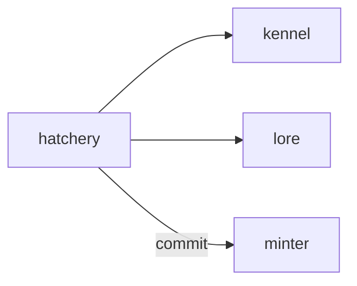

# Hatchery

**Pet Evolution Lab** — Fusion and genetic breeding game to spawn new variants inside the 210-kind canon.

Part of [ComputerPets](https://github.com/RicheyWorks/computerpets). Map: [computerpets-ecosystem](https://github.com/RicheyWorks/computerpets-ecosystem).

| | |
| --- | --- |
| Status | Design scaffold — loop and engine frozen |
| License | MIT |
| Tokens | Minigames never mint or burn. Tired overlay, not a dead lineage. |
| First pet | [Meet Rui first](https://github.com/RicheyWorks/computerpets/blob/main/docs/START-HERE.md). This game is optional. |

## The loop

Kennel is the calculator. Hatchery is the toy: drag two pets, watch the whelp table animate, lock a legal variant, send to Minter. Panda × fish is a red X, not a new species.

## Who plays

Breeders who want a toy, not a spreadsheet.

## What it is not

Not Kennel (that is the calculator). Not a species factory.

## Genre and engine

- Genre: **Simulation**
- Engine: **React / Canvas**
- Stack: TypeScript · React 19 · Canvas 2D · Kennel genetics API · Atelier preview
- Default surface: `8080`

## Architecture



## How you play

1. Drop two owned pets onto the bench.
2. See allele dice in real time.
3. Illegal pair explains why.
4. Commit whelp → mint request, not an overlay clone.

## First slice

Build this and stop.

**Drop two owned pets, animate the whelp table, illegal pair is a red X.**

You know it works when: Illegal pair never writes a token. Partial mint keeps the draft.

## Environment

Node 22

## Failure doctrine

Illegal pair never writes a token. Canvas fail → table still shows odds. Partial mint → Hatchery keeps the draft.

Canon rules that never yield:

- 210 living kinds. No illegal hybrids.
- Overlay pets can get tired, sick, or hide. Tokens are not burned by a minigame.
- Desktop walk stays the main quest. Closing Hatchery must leave Rui walking.

## Neighbors

- computerpets-kennel
- computerpets-lore
- computerpets-atelier
- computerpets-minter
- computerpets-studio

## Layout

```
computerpets-hatchery/
  README.md
  LICENSE
  docs/DESIGN.md
  src/                implementation lands here
```

## Run (Windows)

```powershell
cd app; npm install; npm run dev
```

Meet Rui first via the [flagship start-here](https://github.com/RicheyWorks/computerpets/blob/main/docs/START-HERE.md). This game is optional.

## Links

- Flagship: [RicheyWorks/computerpets](https://github.com/RicheyWorks/computerpets)
- This repo: [RicheyWorks/computerpets-hatchery](https://github.com/RicheyWorks/computerpets-hatchery)
- Map: [RicheyWorks/computerpets-ecosystem](https://github.com/RicheyWorks/computerpets-ecosystem)
- Design file: [docs/DESIGN.md](docs/DESIGN.md)

## License

MIT. See [LICENSE](LICENSE).

---

*Two hundred ten living kinds. Keep them so a line does not go quiet.*
