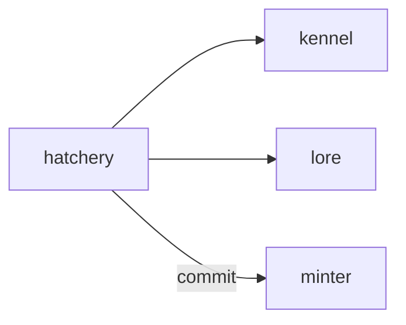

# Hatchery

**Pet Evolution Lab** — A planned breeding game for previewing legal pet variants before requesting a mint.

Part of [ComputerPets](https://github.com/RicheyWorks/computerpets). Map: [computerpets-ecosystem](https://github.com/RicheyWorks/computerpets-ecosystem).

[Status](#status) · [Design](docs/DESIGN.md) · [Contributor start](#contributor-start) · [Ecosystem](https://github.com/RicheyWorks/computerpets-ecosystem)

| Project | At a glance |
| --- | --- |
| Status | Design scaffold; not runnable yet |
| License | MIT |
| Tokens | Minigames never mint or burn. Tired overlay, not a dead lineage. |
| First pet | [Flagship start guide](https://github.com/RicheyWorks/computerpets/blob/main/docs/START-HERE.md) |

## Status

This repository contains a [design](docs/DESIGN.md) and a [source placeholder](src/index.ts). It has no runnable application, build manifest, automated tests, or CI workflow.

The experience, interfaces, integrations, and safeguards below are **implementation plans**, not supported features. The first implementation slice defines the initial contribution target.

## Planned experience

Kennel is the calculator. Hatchery is the toy: drag two pets, watch the whelp table animate, lock a legal variant, send to Minter. Panda × fish is a red X, not a new species.

## Intended audience

Breeders who want a toy, not a spreadsheet.

## Out of scope

Not Kennel (that is the calculator). Not a species factory.

## Planned genre and engine

- Genre: **Simulation**
- Engine: **React / Canvas**
- Stack: TypeScript · React 19 · Canvas 2D · Kennel genetics API · Atelier preview
- Proposed surface: `8080`

## Proposed integration



## Proposed play loop

1. Drop two owned pets onto the bench.
2. See allele dice in real time.
3. Illegal pair explains why.
4. Commit whelp → mint request, not an overlay clone.

## First implementation slice

Initial implementation target:

**Drop two owned pets, animate the whelp table, illegal pair is a red X.**

Acceptance targets: Illegal pair never writes a token. Partial mint keeps the draft.

## Planned environment

Node 22

## Planned safeguards

Illegal pair never writes a token. Canvas fail → table still shows odds. Partial mint → Hatchery keeps the draft.

Design constraints:

- 210 living kinds. No illegal hybrids.
- Overlay pets can get tired, sick, or hide. Tokens are not burned by a minigame.
- Desktop walk stays the main quest. Closing Hatchery must leave Rui walking.

## Related projects

- [computerpets-kennel](https://github.com/RicheyWorks/computerpets-kennel)
- [computerpets-lore](https://github.com/RicheyWorks/computerpets-lore)
- [computerpets-atelier](https://github.com/RicheyWorks/computerpets-atelier)
- [computerpets-minter](https://github.com/RicheyWorks/computerpets-minter)
- [computerpets-studio](https://github.com/RicheyWorks/computerpets-studio)

## Layout

```
computerpets-hatchery/
  README.md
  LICENSE
  docs/DESIGN.md
  src/                implementation lands here
```

## Contributor start

With Git and PowerShell, clone the scaffold and read its design and source marker:

```powershell
git clone https://github.com/RicheyWorks/computerpets-hatchery.git
Set-Location computerpets-hatchery
Get-Content .\docs\DESIGN.md
Get-Content .\src\index.ts
```

Start with the [first implementation slice](#first-implementation-slice). Add the minimum project setup and tests needed for that slice, then document verified run commands. The proposed stack above is a design choice; there is no install or launch command for this checkout yet.

## Links

- Flagship: [RicheyWorks/computerpets](https://github.com/RicheyWorks/computerpets)
- This repo: [RicheyWorks/computerpets-hatchery](https://github.com/RicheyWorks/computerpets-hatchery)
- Map: [RicheyWorks/computerpets-ecosystem](https://github.com/RicheyWorks/computerpets-ecosystem)
- Design file: [docs/DESIGN.md](docs/DESIGN.md)

## License

MIT. See [LICENSE](LICENSE).

---

*Two hundred ten living kinds. Keep them so a line does not go quiet.*
